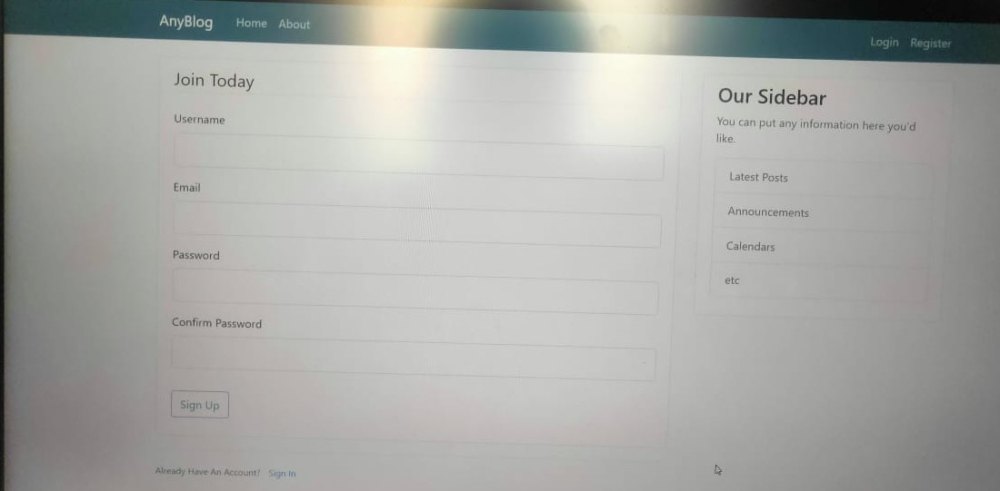

<h1>AnyBlog</h1>
<h2>It is a blog posting web-site where people can share knowledge made with flask and inspired from medium.com</h2>
  
<h2>Glimpse of website</h2>
 <h3> The Login Page</h3>

 <h3> The Signup page </h3>

 <h3> The Home Page </h3>

 <h3> The Profile Page </h3>

 <h3> Posting New Blog </h3>

  
<h4> Made this for Python Project SEM-4 and learnt from youtube </h4> 
